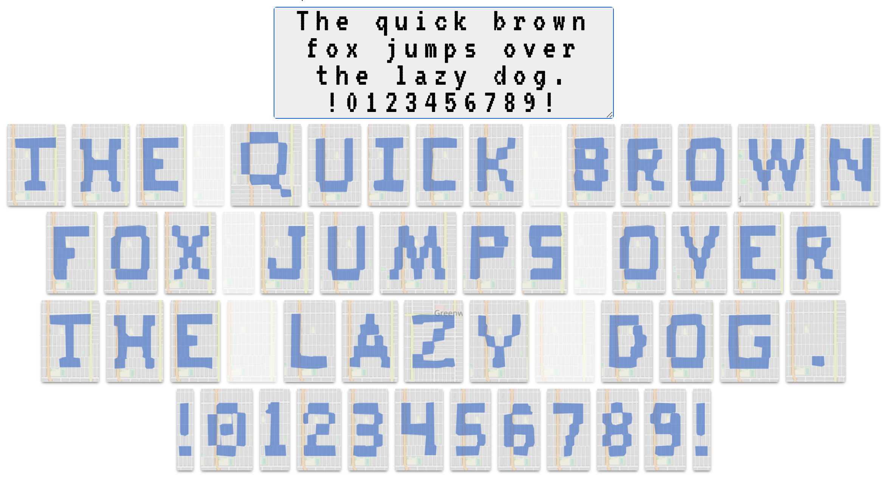

### Tommy Unger's github page

I enjoy designing and making things from analytics experiences to backend systems solutions. I will always get my hands dirty with data from kilobytes to petabytes in size. Valuable insights and solutions can be found everywhere and I like to help others see things in data that they didn't think was even possible.

- My personal website: https://tommyseattle.com (hope I don't move away from Seattle!)
- Very small business: https://campusbuilding.com (Microsoft and Amazon HQ maps)
- Social(?) media: @<a href="https://twitter.com/tommyunger">tommyunger</a> | <a href="https://www.linkedin.com/in/tommyunger/">LinkedIn</a>
- During the COVID times I've been biking and running the letters of the alphabet as well as numbers and ascii characters: 

